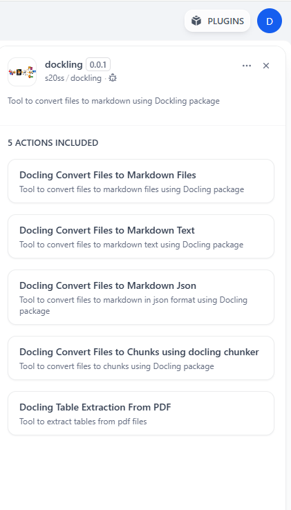
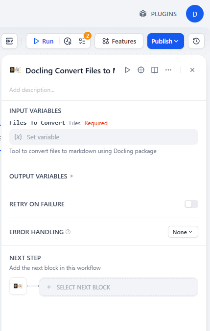

## dify_plugin_dockling

**Author:** s20ss
**Version:** 0.0.1
**Type:** tool

### Description
A collection of tools for document processing, conversion, and extraction, designed to work with the Dify platform and Dockling integration.

---

## Tools

The following tools are available in the `tools/` directory:

- **convert_to_chunks.py**: Splits documents into smaller, manageable chunks for processing.
- **convert_to_markdown_files.py**: Converts input files into Markdown format.
- **convert_to_markdown_json.py**: Converts documents to Markdown and outputs as JSON.
- **convert_to_markdown_text.py**: Converts documents to plain Markdown text.
- **table_extraction_from_pdf.py**: Extracts tables from PDF files.
- **utils.py**: Utility functions used by other tools.

## Screenshots 

## License
See `PRIVACY.md` for privacy and usage information.

## Github Repo
https://github.com/s20ss/docling-dify-plugin

